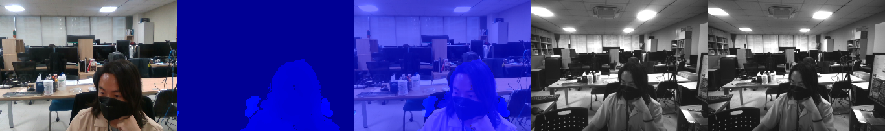

# Multiple Realsense(e.g. D435) Video Capture 




(RGB, distance-clipped depth, aligned depth, left IR, right IR)


## Installation 

* Please be sure to install [Intel RealSense SDK](https://github.com/IntelRealSense/librealsense/releases).
* Then, install python packages: 
    ``` bash 
    pip install -r requirements.txt
    ```


## Usage 

* Check the ```config.yaml``` (you can change whenever you need). 
* Run the code:
    ```bash
    python two-realsense.py --clip 2.0 --alpha 0.1  # for two camera devices 
    # or 
    python single-realsense.py --clip 2.0 --alpha 0.1 # for one camera device 
    ```
* Control by your keyboard
    * 'v' button - to record your video 
    * 'SPACE' button - to save your video 
    * 's' button - to save a sample image (you can customize it if you want)


## Demo 

* Reference to [align-depth2color.py](https://github.com/IntelRealSense/librealsense/blob/master/wrappers/python/examples/align-depth2color.py) for depth and color ```alignment``` & ```distance clipping```. 

* For understanding how it works, run the demo code with single realsense camera: 

  ```
  python demo.py 
  ```


## Notice 

- [ ] Saving point cloud in `.ply`


***

### Reference 

1. https://www.meshlab.net/

2. [librealsense/pyglet_pointcloud_viewer.py](https://github.com/IntelRealSense/librealsense/blob/development/wrappers/python/examples/pyglet_pointcloud_viewer.py)

3. [Save pointcloud (RGB) without meshing #7747](https://github.com/IntelRealSense/librealsense/issues/7747)

4. [Aligning depth image (and pointcloud) to RGB image is slightly off in the vertical axis #5834](https://github.com/IntelRealSense/librealsense/issues/5834)

5. [Pointcloud, how remove background? #8170](https://github.com/IntelRealSense/librealsense/issues/8170)

   

